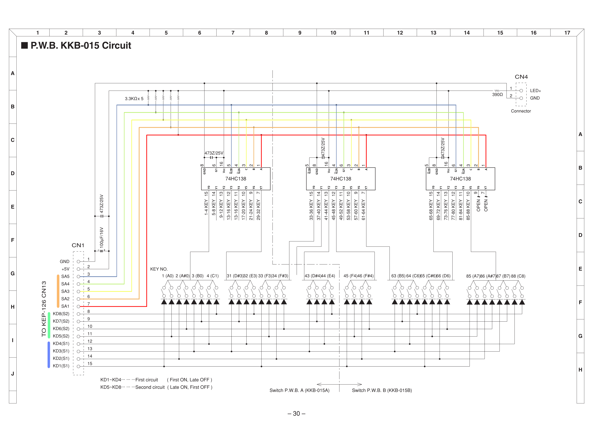

# ES110

Reverse engineering and drawing schematics in KiCAD for a broken Kawai ES110 in an attempt to use parts of it.

Kawai, as with other manufacturers used to provide schematics in their service manuals, now they have a walled garden.

The aim here is to document enough to be able to create a new board for a new project.

If you can help to make these better, please do.

## Notes

* The +5v signal to pin 2 of CN7/CN11 is taken as true as there is continuity between these pins and the positive leg of the electrolytic capacitor next to CN7. This cap is connected to the step-down converter.

* The power input is centre positive.

### KEP-692

This is the motherboard to the whole piano. The two connectors we are interested in are CN11 (bottom left) and CN7 (Bottom right).

* CN11 - The control panel, KEP-643 and KEP-644 connects here.
* CN7  - The keybed connects here.

#### Keybed connector (CN7)

The pinout seems to match that of the Kawai ES4/ES1, which can be seen on page 30 of the [service manual](./docs/es4es1p.pdf). Page 31 shows the key table.

### KEP-643

On the motherboard, pin 2 of CN11 has continuity with the positive side of C88 electrolytic capacitor next to the SI-8008TM step down converter, so this is 5v, right? But pin 2 of CN6 on KEP-643 which is connected via a cable, is not connected to anything., as can be seen here (pin 1 is on the right):

### KEP-644

This is the second of the control panel boards, this has the power button/led and the volume slider.

The slider seems to be a custom Alps potentiometer, labelled 825C-10KB.

The capacitor is connected to the button via a resistor and seems to be a debounce circuit.

## The key matrix

By examining the layout of CN7 in the image above, i.e. where the resistors are aligned with which pins, they do conect to, btw, see the schematics. they just seem to match the pinout of the ES4 connector. It could well be different, the order of hte pins may differ for example.

This would then result in the following key matrix:

In fact, I wonder if KD1 is pin 8 of CN7, but this depend entirely on the output of U15 which all enter U4, the Kawai K023-FP tone generator custom ASIC.

## Disclaimer

I cannot guarantee the accuracy of these schematics.

They've been traced with a multimeter and by eye.

I'm a programmer, not an EE.
